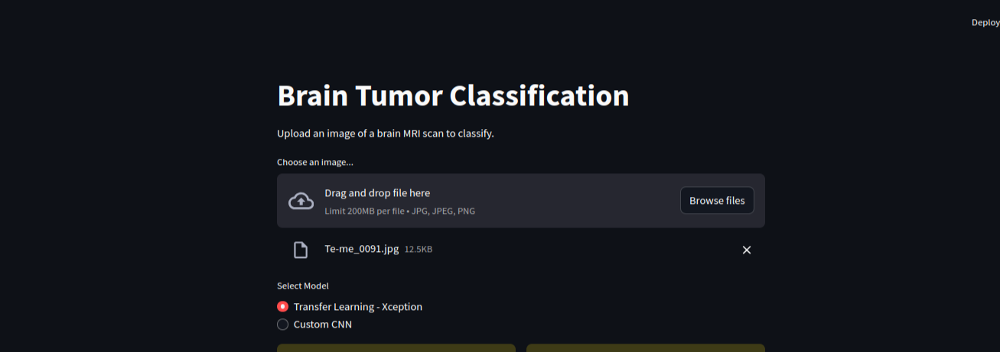
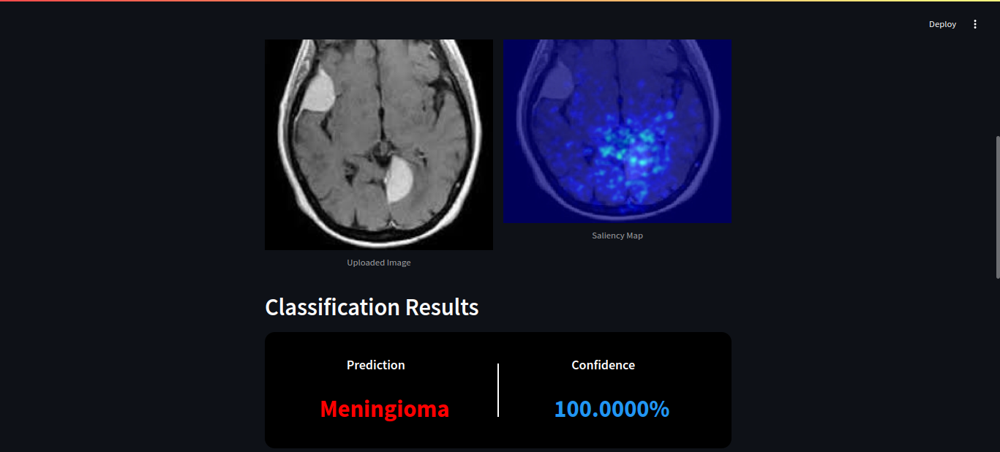
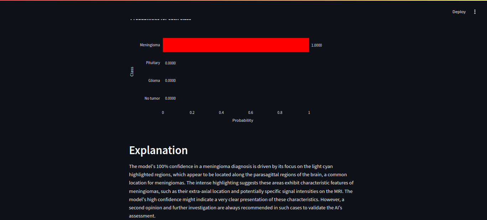

# Brain-Tumor-Classification

The objective of this project is to train neural networks to classify tumors in brain MRI scans. You will learn about how to construct different neural network architectures through transfer learning and custom convolutional layers, and use the Gemini 1.5 Flash model to generate explanations for the model's predictions.
Live Demo -

## Screenshots

